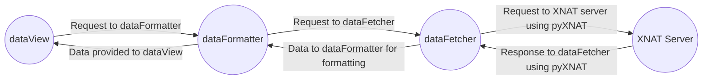

# statsXNAT

statsXNAT is a set of programs which gives the user to get an overview of the data present at XNAT servers. statsXNAT uses pyXNAT to connect to the XNAT servers using RESTful Web services provided by XNAT.


## Dependencies

 - [pyXNAT](https://pyxnat.github.io/pyxnat/index.html) 

## Getting Started
- ```pip3 install -r requirements.txt```
- ```python3 configFileGenerator.py```
- ```python3 dataView.py```

## Flow Diagram

The following diagram show the flow of information from different part of the program

